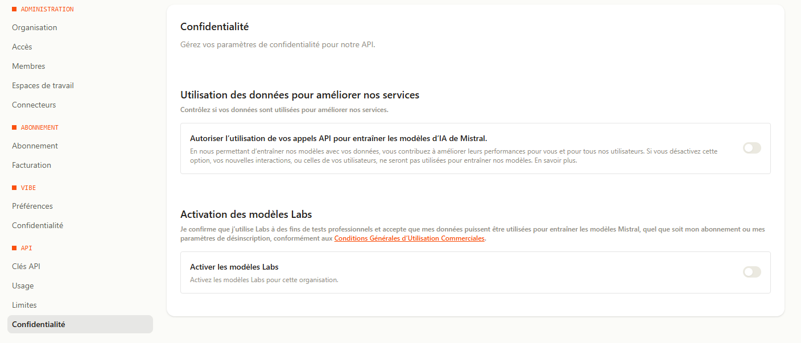
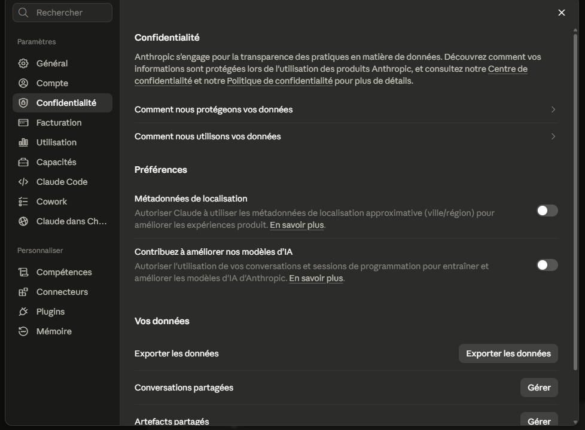

# Prérequis — de la machine nue au vault opérationnel

Tout ce qu'il faut installer avant le plugin et `/vault-init`, dans l'ordre. Seules les
sections 1 et 2 sont indispensables ; 3 et 4 ne concernent qu'un vault partagé
via Google Drive ; 5 n'est nécessaire que pour la recherche sémantique et l'OCR
(sans elle, tout fonctionne en repli grep) ; 6 est la vitrine humaine.

## 1. Un terminal Linux — sous Windows : WSL

Claude Code tourne dans un terminal (Linux, macOS, ou Windows via WSL). Les
scripts de ce repo supposent un shell **bash**.

Sous Windows, installer WSL (PowerShell **en administrateur**, puis redémarrer) :

```powershell
wsl --install
```

Ubuntu est installé par défaut. Tout ce qui suit s'exécute **dans le terminal
WSL/Ubuntu**, pas dans PowerShell.
Documentation : https://learn.microsoft.com/fr-fr/windows/wsl/install

## 2. Claude Code

Installation en une commande (installeur natif, recommandé) :

```bash
curl -fsSL https://claude.ai/install.sh | bash
```

Alternative via npm (requiert Node.js ≥ 18) :

```bash
npm install -g @anthropic-ai/claude-code
```

Puis lancer `claude` dans un dossier : la première exécution ouvre la
connexion au compte (abonnement Claude, ou clé API Claude Developer Platform).
Documentation : https://code.claude.com/docs

Vérification :

```bash
claude --version
```

## 3. Google Drive pour Desktop (vault partagé uniquement)

Le vault n'est qu'un dossier de fichiers markdown : pour le partager entre
plusieurs machines/personnes, il vit dans un dossier synchronisé par **Google
Drive pour Desktop**, installé **côté Windows** (ou macOS) — pas dans WSL.

- Télécharger et installer : https://support.google.com/a/users/answer/13022292
- Se connecter au compte Google ; le lecteur apparaît (par défaut `G:` sous
  Windows).
- Un vault local sans partage n'a pas besoin de Drive : n'importe quel dossier
  convient, passer à la section 5.

## 4. Google Drive vu depuis WSL

WSL n'expose pas automatiquement un lecteur apparu **après** son démarrage :
`/mnt/g` peut être vide ou absent alors que `G:` existe côté Windows.

```bash
# une fois Google Drive lancé côté Windows :
sudo mkdir -p /mnt/g
sudo mount -t drvfs G: /mnt/g
ls "/mnt/g/Mon Drive"   # doit lister le contenu du Drive
```

À refaire après chaque redémarrage de WSL, ou automatiser via `/etc/fstab` :

```
G: /mnt/g drvfs defaults 0 0
```

(Le montage fstab échoue silencieusement si Drive n'est pas encore lancé —
relancer `sudo mount -a` dans ce cas.)
Dépannage détaillé : https://superuser.com/questions/1781174/google-drive-in-wsl

C'est exactement l'échec que `vault-check.sh` détecte : « vault introuvable —
le lecteur du vault est-il monté ? ».

## 5. agentic-toolbox (recherche sémantique + OCR — facultatif)

Le moteur sémantique et OCR des commandes `/doc-*` est
**[agentic-toolbox](https://github.com/Zairth/agentic-toolbox)** : recherche
sémantique sur dossier markdown (embeddings `mistral-embed` épinglés, index
JSONL dans le vault), OCR de PDF/scans, routeur LLM multi-fournisseurs.
Sans lui, `/doc-query` dégrade vers grep avec un avertissement explicite.

Clé API (tier gratuit) : **`MISTRAL_API_KEY` est la seule requise ici** —
embeddings et OCR sont épinglés sur Mistral, sans fallback (espaces vectoriels
incompatibles). Création : https://console.mistral.ai/?profile_dialog=api-keys

> ⚠️ **Ce qui sort du vault, et ce que le fournisseur en fait.** Indexer, c'est
> envoyer le texte de `wiki/` chez Mistral ; chaque `/doc-query` y envoie aussi
> la question ; l'OCR y envoie les pièces converties. Or le **palier gratuit
> « Experiment » autorise par défaut l'usage de ces appels pour entraîner les
> modèles** — l'opt-out existe, gratuit, mais il faut aller le cocher :
> console Mistral → Administration → **Confidentialité** → désactiver
> « Autoriser l'utilisation de vos appels API pour entraîner les modèles ».
> Le faire **avant la première indexation** : la désactivation ne vaut que pour
> les interactions futures. Laisser aussi « modèles Labs » désactivé — activés,
> ils autorisent l'entraînement quel que soit l'opt-out. Les offres payantes
> sont exclues par défaut. Un vault contenant des données personnelles, des
> pièces confidentielles ou un dossier en cours : vérifier ce réglage d'abord.

L'état correct — les deux interrupteurs sur off :



Noter la formulation de Mistral : « vos **nouvelles** interactions … ne seront
pas utilisées ». La désactivation ne rattrape pas ce qui a déjà été envoyé —
d'où l'intérêt de la faire avant d'indexer. Pour du contenu déjà transmis, le
recours est une demande d'effacement (RGPD art. 17) auprès du fournisseur.

**Le second canal : la session Claude Code elle-même.** Le vault parle au
fournisseur d'embeddings ; la session, elle, parle à Anthropic — et y fait
passer tout ce que Claude lit ou écrit, y compris ce que vous collez à la main
dans la conversation. Le régime dépend de la facturation (`/status` indique
laquelle) : sur **abonnement** (Free/Pro/Max), les conversations et sessions de
code servent à l'entraînement **sauf si l'option est désactivée** ; par **clé
API** ou en offre Work/Enterprise, elles n'y servent pas. Le réglage est dans
claude.ai → Paramètres → Confidentialité :



Même logique que chez Mistral : le réglage vaut pour les conversations
nouvelles ou reprises, pas pour le passé.

**Et une règle qui ne dépend d'aucun réglage** : `/doc-query` et `/doc-lint`
tournent en sub-agent isolé précisément pour que le contenu des notes ne
remonte pas dans la conversation principale. Coller un rapport ou un extrait de
note à la main court-circuite cette protection. Sur un vault sensible, laisser
les commandes faire leur travail vaut mieux que n'importe quelle case cochée.

### Voie nominale : le plugin (zéro clone)

La toolbox existe en plugin Claude Code avec **serveur MCP intégré** — les
commandes `/doc-*` utilisent ses outils en priorité. Seul prérequis :
[uv](https://docs.astral.sh/uv/), qui gère Python et les dépendances tout seul :

```bash
curl -LsSf https://astral.sh/uv/install.sh | sh
```

Puis dans Claude Code :

```
/plugin install agentic-toolbox@zairth_store
```

Les clés API sont demandées à l'installation (stockage sécurisé Claude Code) :
remplir `MISTRAL_API_KEY`, le reste peut rester vide. Chaque outil reçoit son
dossier en argument — les commandes `/doc-*` passent toujours le vault du
projet explicitement.

### La porte en ligne de commande (hooks et wrappers)

Le plugin installé ci-dessus suffit — **rien de plus à faire**. Cette section
explique seulement d'où vient la seconde voie d'accès au moteur, celle
qu'empruntent les hooks.

Un hook Claude Code est un script shell : pas de session, pas de client MCP.
Cette catégorie d'appelants ne peut donc pas passer par les outils MCP, et le
moteur expose pour elle une porte en ligne de commande (`python -m cli`, depuis
sa version 4.1.0). Les wrappers `vault-index.sh`, `vault-search.sh` et
`vault-lexical.sh` du plugin l'utilisent.

Deux conséquences pratiques :

- **`uv` est nécessaire** pour cette voie (il l'était déjà pour le serveur
  MCP). Absent → les wrappers échouent avec un message explicite, `/doc-query`
  dégrade vers grep et le hook de contexte se tait ;
- **aucun venv à créer** : `uv` résout les dépendances depuis le
  `requirements.txt` du moteur et les met en cache.

Le moteur est trouvé automatiquement dans le cache des plugins. Pour pointer
un clone (développement du moteur), écrire son chemin — une seule ligne — dans
le `.claude/toolbox-path.local` **du projet**, fichier gitignoré :

```bash
git clone https://github.com/Zairth/agentic-toolbox ~/projects/agentic-toolbox
echo "$HOME/projects/agentic-toolbox" > .claude/toolbox-path.local
```

> **Version minimale** : commit `97b2dac` (« logs CLI sur stderr, stdout
> réservé au JSON »). Depuis ce commit, stdout des CLI est du JSON pur,
> parsable strictement — aucune parade de filtrage (`sed`) n'est nécessaire.
> Un clone à jour de `main` suffit.

## 6. Obsidian (vitrine humaine — facultatif)

Le système fonctionne entièrement sans Obsidian : le vault n'est que des
fichiers markdown, Claude Code y accède directement. Obsidian est la vitrine
**humaine** — graphe, wikilinks cliquables, lecture confortable.

- Télécharger : https://obsidian.md/download — s'installe **côté Windows**
  (ou macOS), là où le lecteur Drive est visible, pas dans WSL.
- Après `/vault-init` : « Ouvrir un coffre » → choisir le dossier du vault
  (ex. `G:\Mon Drive\<Section>\<MonVault>`).
- **Piège WSL** : le vault doit vivre côté Windows (`/mnt/<lettre>/...` vu de
  WSL). Un vault créé dans le disque WSL (`~/...`) fait planter Obsidian à
  l'ouverture (`EISDIR ... watch '\\wsl.localhost\...'`) — il ne sait pas
  surveiller un chemin réseau UNC. Le cas échéant : déplacer le vault vers
  `/mnt/...` et repointer `.claude/vault-path.local` + `settings.local.json`
  du projet.
- Les écritures faites par Claude hors d'Obsidian peuvent mettre un moment à
  apparaître — Ctrl+R recharge ; `/doc-lint` fait foi.
- `/vault-init` exclut `archives/` de l'index d'Obsidian
  (`.obsidian/app.json`) : Obsidian avale tous les `.md` du vault, et les
  markdown OCR archivés y référencent des images non extraites qui
  apparaîtraient en nœuds fantômes dans le graphe. Le réglage est posé même si
  Obsidian n'a jamais ouvert le vault — il préserve une config existante à la
  première ouverture. Si Obsidian tournait pendant l'init : le redémarrer.

## 7. python3 (présent par défaut — bon à savoir)

Aucune installation à prévoir : WSL, Linux et macOS livrent `python3`. Ce qui
s'en sert dans le plugin, et ce qui se passe s'il manque :

- **hooks** (pistes sémantiques sous chaque prompt, dépôt du transcript avant
  compactage) → le hook sort en silence, sans erreur ;
- **`/vault-init`, fusion de la config Obsidian** — uniquement quand
  `.obsidian/app.json` existe déjà : sans `python3`, le script n'y touche pas
  et affiche la manipulation à faire à la main. Sur un vault neuf, le fichier
  est écrit en bash pur, sans dépendance ;
- **lecture des PDF à couche de texte** (`scripts/pdf-text.py`) → sans
  `python3`, un PDF produit par un logiciel repart vers l'OCR, qui le lira
  moins bien et à un coût d'API. Rien ne casse, la qualité baisse.

Bibliothèque standard seule dans les trois cas : aucun `pip install`, aucun
accès réseau. (Le moteur sémantique, lui, a ses propres prérequis Python —
section 5.)

## Récapitulatif

| # | Brique | Obligatoire ? | Vérification |
|---|--------|---------------|--------------|
| 1 | Terminal bash (WSL sous Windows) | oui | `bash --version` |
| 2 | Claude Code | oui | `claude --version` |
| 3 | Google Drive pour Desktop | vault partagé seulement | lecteur `G:` visible côté Windows |
| 4 | Montage Drive dans WSL | vault partagé sous WSL | `ls "/mnt/g/Mon Drive"` |
| 5 | agentic-toolbox (plugin) + `uv` + `MISTRAL_API_KEY` | recherche sémantique/OCR seulement | outil MCP `llm_check`, ou `/doc-query` qui annonce son repli grep |
| 6 | Obsidian | non (vitrine humaine) | ouvrir le vault comme coffre |
| 7 | `python3` | non (hooks, fusion de config Obsidian, lecture des PDF à couche de texte ; dégradation silencieuse) | `python3 --version` |

Ensuite, dans Claude Code ([README](README.md#installation)) :

```
/plugin marketplace add https://github.com/Zairth/marketplace
/plugin install claude-vault-drive@zairth_store
/plugin install agentic-toolbox@zairth_store   # facultatif : recherche sémantique + OCR
```

puis, dans chaque projet : `/vault-init "/mnt/g/Mon Drive/<Section>/<MonVault>"`.
